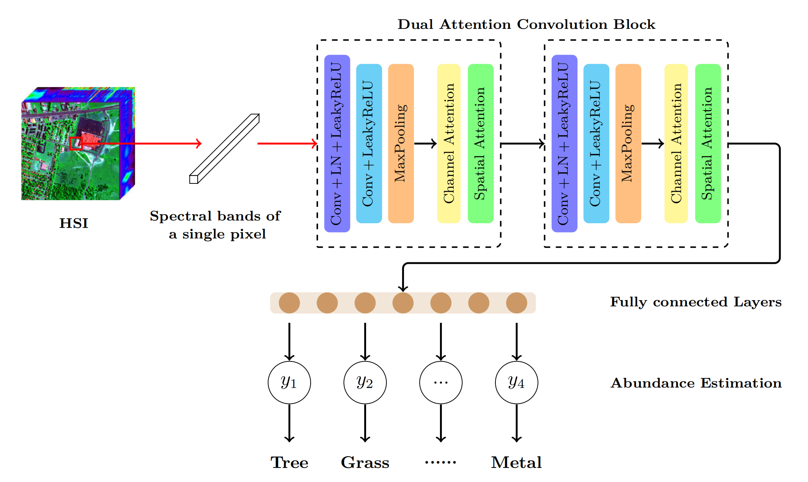
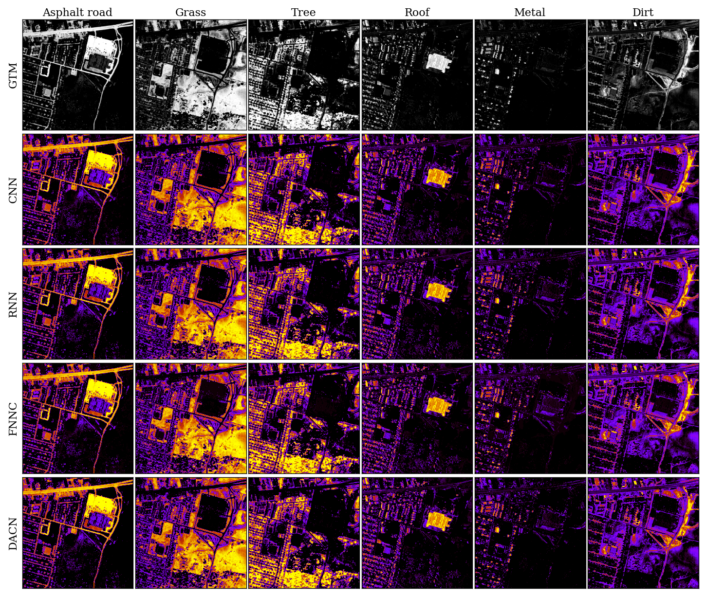

# Hyperspectral Unmixing (半成品，禁止Fork!!!!!)

Hyperspectral image unmixing of convolutional neural network (No fork, semi-finished products)

<div align=center> 
    
    Fig 1. Architecture of DACN with spectral–spatial feature extraction of HSI.
</div>

## Citation

If you find DACN useful in your research, please consider citing.

## Setup

- Python 3.8
- TensorFlow 2.3.0

Recommend use conda create a virtual environment and to install dependencies using: 
```
pip install -r requirements.txt
```

## Dataset

We provide two processed datasets: Jasper Ridge(jasper), Urban(urban) in [datasets](datasets).

- <b>data.npy:</b> hyperspectral data file.

- <b>data_gt.npy:</b> ground truth file.

- <b>data_m.npy:</b> endmembers file.

## Usage

<table>
    <tr>
        <td>
            
            Fig 2. Quantitative analysis of learning rate for the DACN method in the Jasper Ridge data set.
        </td>
        <td>
            
            Fig 3. rmsAAD values of the Jasper Ridge and Urban data set by different methods.
        </td>
    </tr>
</table>

After setting the parameters in [`config/config.json`](config/config.json), enter the following command in the terminal:

```
python run.py
```

<b>More Details:</b>

Use `python run.py -h` to get more parameters setting details.

## Unmixing Result

<div align=center> 
    
    Fig 4. Ground-truth and estimated abundances obtained for each endmember material in the Urban data set by different methods.
</div>

## Misc.

Code has been tested under:

- Windows 10 with 32GB memory, a RTX2060 6G GPU and AMD R7-4800H CPU.
